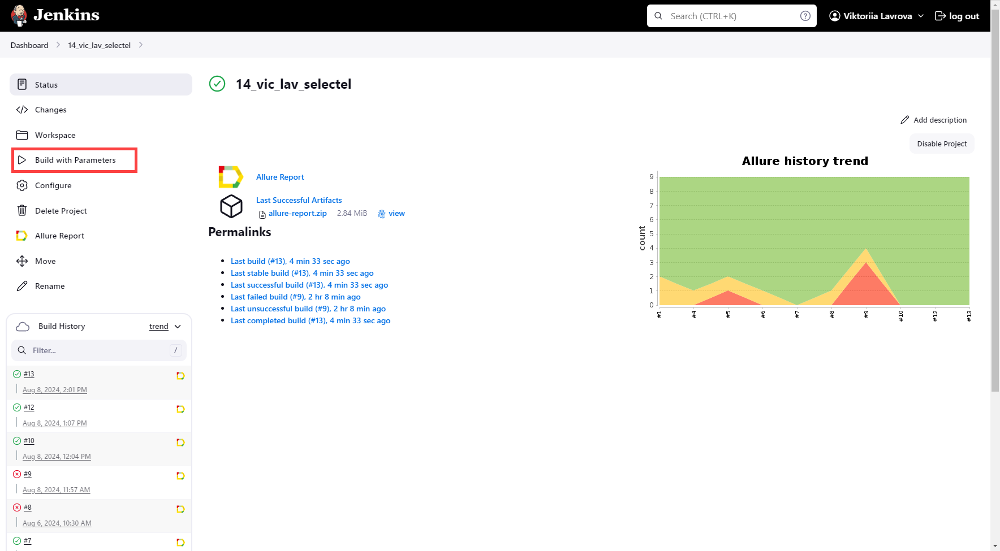
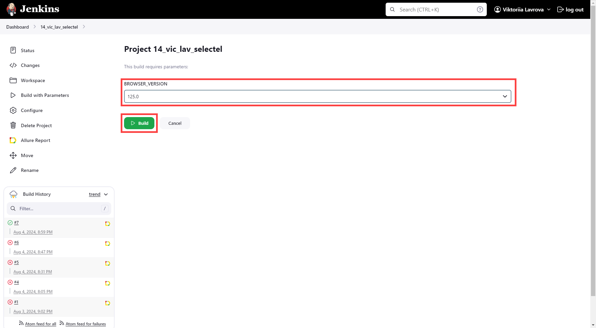
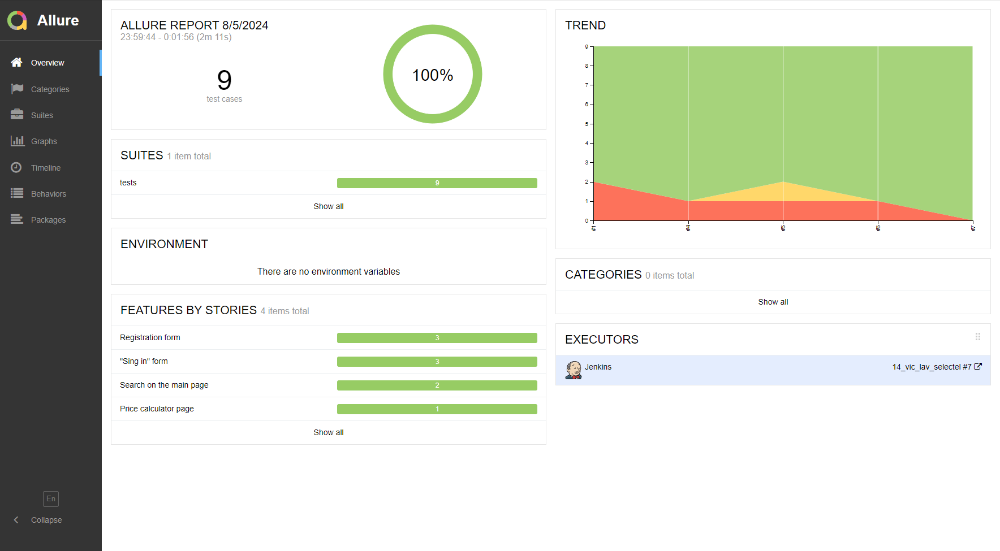
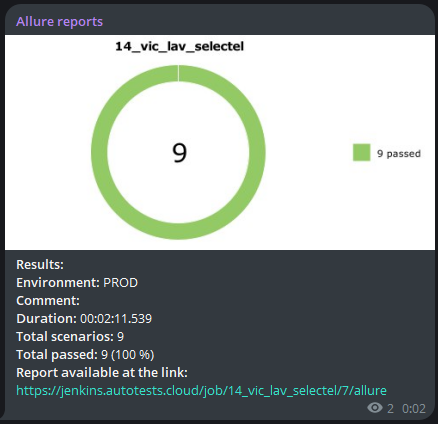
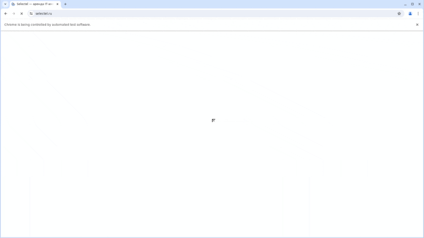

## Проект по автоматизации тестирования сайта компании Selectel
___
Содержание:
- [Исходные данные](#item-1)
- [Цель проекта](#item-2)
- [Используемые технологии](#item-3)
- [UI тесты](#item-4)
- [Сборка проекта и запуск тестов](#item-5)
- [Отчет о прохождении тестов](#item-6)
- [Уведомление о прохождении тестов](#item-7)
- [Видео о прохождении тестов](#item-8)
___

### Исходные данные

[Cайт компании Selectel](https://selectel.ru)

___

### Цель проекта:

Тестирование основных функций сайта, позволяющих покупателю успешно найти желаемый продукт, оценить стоимость 
необходимых услуг, осуществить регистрацию и вход в личный кабинет, для последующей покупки услуг.

___

### Используемые технологии

<table width="100%" border='0'>
  <tbody>
    <tr>
      <td>Язык программирования, IDE</td>
      <td align="center">
        
        
      </td>
    </tr>
    <tr>
      <td>Библиотеки, фреймворки для написания тестов</td>
      <td align="center">
        
        
      </td>
    </tr>
    <tr>
      <td>
        Запуск тестов
      </td>
      <td>
        
        
      </td>
    </tr>
    <tr>
      <td>
        Формирование отчета и отправление уведомлений
      </td>
      <td>
        
        
      </td>
    </tr>
  </tbody>
</table>

___

### UI тесты

- Работа поиска на главной странице при условии:
    - Правильного поискового ввода
    - Неправильного поискового ввода
- Вход в личный кабинет при условии:
    - Верного пароля и номера аккаунта (при отсутствии заполнения номера телефона в аккаунте)
    - Верного пароля и номера аккаунта (при наличии заполненного номера телефона в аккаунте)
    - Верного номера аккаунта и неправильного пароля
- Прохождение регистрации при условии:
    - Верно заполненных всех полей
    - Неверно заполненных обязательных полей
    - Пустых обязательных полей
- Работа калькулятора цен на услуги:
    - Возможность добавления всех услуг в корзину для расчета стоимости и их последующего удаления

___

### Сборка проекта и запуск тестов

Сборка, параметризация и запуск проекта производятся удаленно с помощью **Jenkins**.
При каждом запросе на тестирование браузера **Selenoid** запускает новый **Docker**-контейнер и 
останавливает его после закрытия браузера. Параметр, который можно изменить перед запуском проекта, - это версия браузера **Chrome**.

Для запуска проекта необходимо:
- Перейти по [ссылке](https://jenkins.autotests.cloud/job/14_vic_lav_selectel/) к проекту в **Jenkins**
- Нажать **"Build with Parameters"**
- Выбрать версию браузера (или оставить значение по умолчанию)
- Нажать **"Build"**

Все необходимые настройки проекта и команды запуска можно посмотреть во вкладке **"Configure"** проекта в **Jenkins**.

___

### Отчет о прохождении тестов

Отчет формируется в **Allure Report** автоматически после прохождения тестов. 
Открыть его можно как из **Jenkins** для интересующего запуска проекта, так и по [ссылке](https://jenkins.autotests.cloud/job/14_vic_lav_selectel/7/allure/).

___

### Уведомление о прохождении тестов

Проект в **Jenkins** настроен таким образом, чтобы уведомления приходили в конкретный чат 
приложения **Telegram**.

___

### Видео о прохождении тестов
В **Allure** отчете для всех тестов приведены видео с их прохождением. 
Ниже приведены:
- все, кроме последнего теста  

- последний тест  

