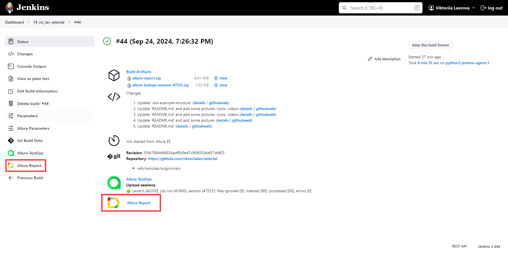
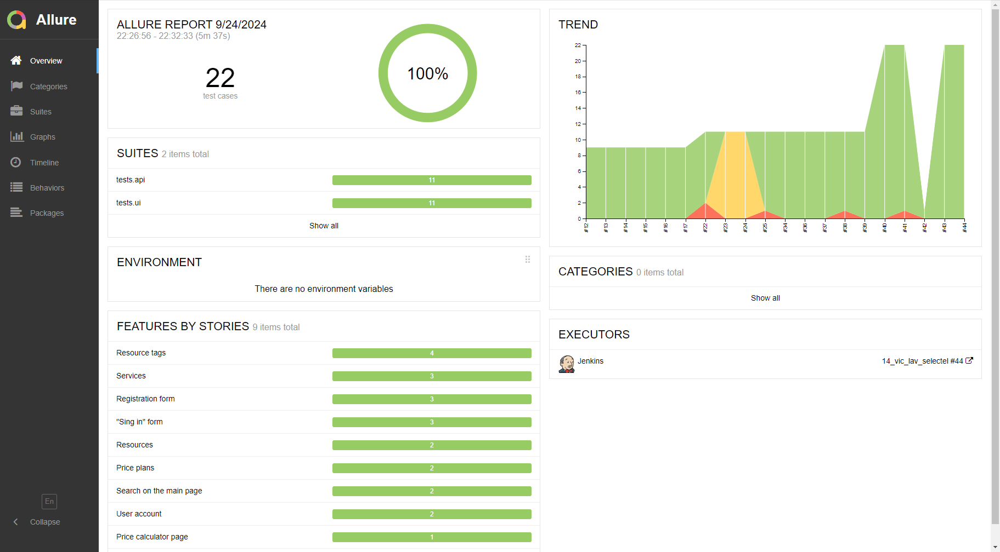
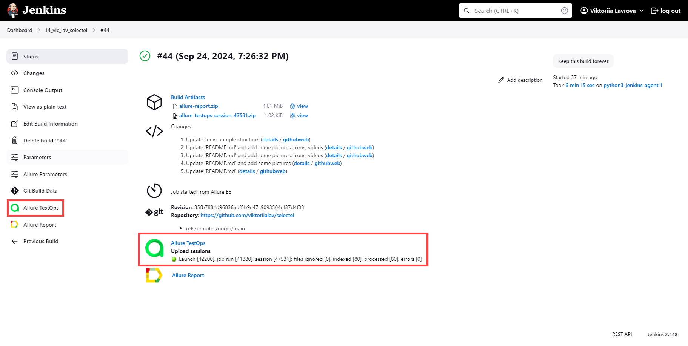
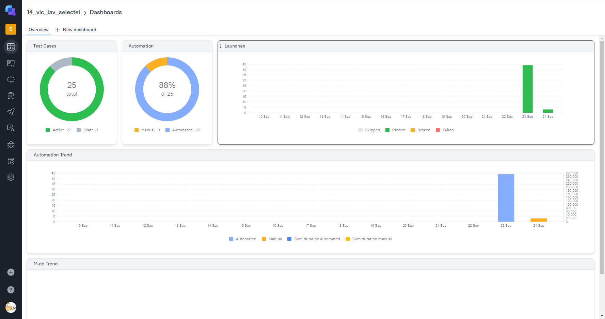
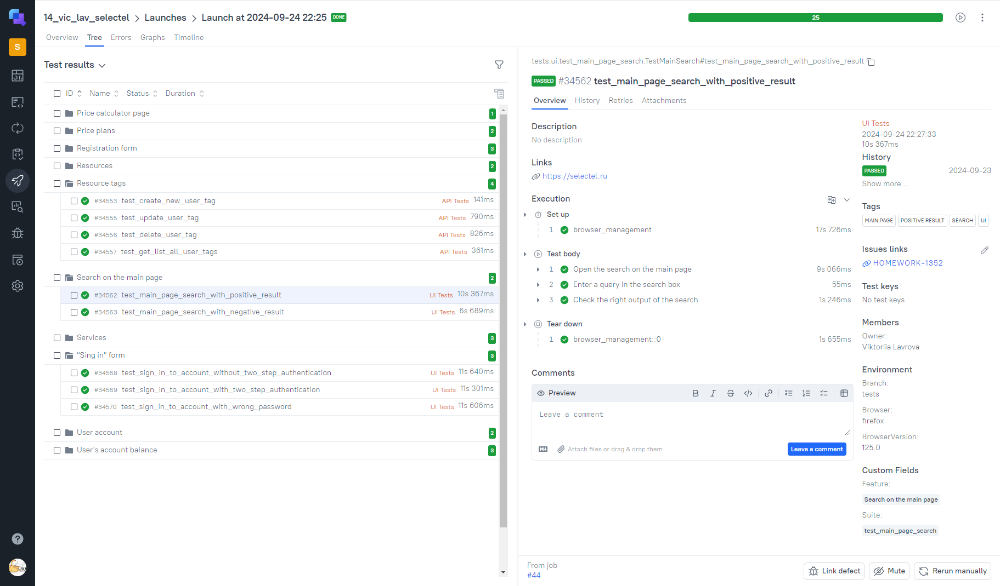
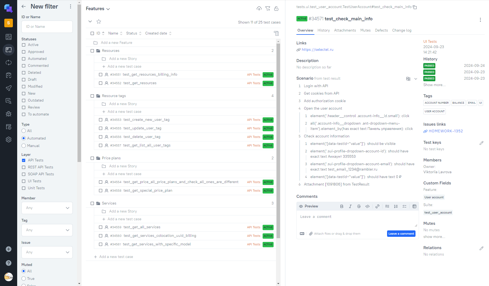

## Проект по автоматизации тестирования сайта компании Selectel
___
### :open_file_folder: Содержание:
- [Исходные данные](#item-1)
- [Цель проекта](#item-2)
- [Используемые технологии](#item-3)
- [UI автотесты](#item-4)
- [API автотесты](#item-5)
- [Ручные UI тесты](#item-6)
- [Сборка проекта и запуск тестов](#item-7)
- [Отчет о прохождении тестов](#item-8)
- [Уведомление о прохождении тестов](#item-9)
- [Видео о прохождении тестов](#item-10)
___
<a id="item-1"></a>
### :jigsaw: Исходные данные

- [Cайт компании **Selectel**](https://selectel.ru)

<p align="center">

</p>

- [Документация к **API**](https://developers.selectel.ru/?pk_vid=19f8c726f4b959a717271225720b01ca)

<p align="center">

</p>

___
<a id="item-2"></a>
### :dart: Цель проекта:

Тестирование основных функций сайта, позволяющих покупателю успешно найти желаемый продукт, оценить стоимость 
необходимых услуг, осуществить регистрацию и вход в личный кабинет, для последующей покупки услуг.

___
<a id="item-3"></a>
### :desktop_computer: Используемые технологии

<table width="100%" border='0'>
  <tbody>
    <tr>
      <td>Язык программирования, IDE</td>
      <td align="center">
        <a target="_blank" href="https://www.python.org/">
          
        </a>
        <a target="_blank" href=https://www.jetbrains.com/pycharm/>
          
        </a>
      </td>
    </tr>
    <tr>
      <td>Библиотеки, фреймворки для написания тестов</td>
      <td align="center">
        <a target="_blank" href=https://www.selenium.dev/>
          
        </a>
        <a target="_blank" href=https://github.com/yashaka/selene>
          
        </a>
        <a target="_blank" href=https://docs.pytest.org/en/stable/index.html#>
          
        </a>
        <a target="_blank" href=https://requests.readthedocs.io/en/latest/#>
          
        </a>
      </td>
    </tr>
    <tr>
      <td>
        Запуск тестов
      </td>
      <td align="center">
        <a target="_blank" href=https://www.jenkins.io/>
          
        </a>
        <a target="_blank" href=https://github.com/aerokube/selenoid>
          
        </a>
      </td>
    </tr>
    <tr>
      <td>
        Формирование отчета и отправление уведомлений
      </td>
      <td>
        <a target="_blank" href=https://qameta.io/>
          
        </a>
        <a target="_blank" href=https://allurereport.org/>
          
        </a>
        <a target="_blank" href=https://www.atlassian.com/ru/software/jira>
          
        </a>
        <a target="_blank" href=https://telegram.org/>
          
        </a>
      </td>
    </tr>
  </tbody>
</table>

___
<a id="item-4"></a>
### :page_with_curl: UI автотесты

- Работа поиска на главной странице при условии:
    - Правильного поискового ввода
    - Неправильного поискового ввода
- Вход в личный кабинет при условии:
    - Верного пароля и номера аккаунта (при отсутствии заполнения номера телефона в аккаунте)
    - Верного пароля и номера аккаунта (при наличии заполненного номера телефона в аккаунте)
    - Верного номера аккаунта и неправильного пароля
- Прохождение регистрации при условии:
    - Верно заполненных всех полей
    - Неверно заполненных обязательных полей
    - Пустых обязательных полей
- Работа калькулятора цен на услуги:
    - Возможность добавления всех услуг в корзину для расчета стоимости и их последующего удаления
- Аккаунт пользователя (с регистрацией через API)
    - Проверка наличия в аккаунте основной информации о пользователе и балансе счета
    - Добавление двух серверов в список сравнения

___
<a id="item-5"></a>
### :page_with_curl: API автотесты

Распределенные серверы:
- Работа с ресурсами пользователя:
  - Получение списка доступных для использования ресурсов
  - Получение информации о задолженностях по оплате
- Работа с тегами ресурсов пользователя
  - Создание нового тега
  - Получение списка имеющихся тегов
  - Изменение имени тега по его `uuid`
  - Удаление тега по его `uuid`
- Работа с тарифными планами:
  - Получение списка возможных тарифных планов
  - Получение информации о конкретном тарифном плане по его `uuid`
- Работа с предоставляемыми услугами:
  - Получение полного списка доступных услуг
  - Получение списка доступных услуг конкретного типа
  - Запрос стоимости услуги (при указании типа услуги, тарифного плана и локации)
___
<a id="item-6"></a>
### :page_with_curl: Ручные UI тесты

Баланс аккаунта пользователя:
- Открыть меню "Баланс и платежи" в личном аккаунте
- Открыть страницу системы оплаты для пополнения баланса аккаунта пользователя
- Проверить все опции вкладки "Услуги" в меню "Баланс и платежи"

___
<a id="item-7"></a>
### :rocket: Сборка проекта и запуск тестов

Запустить проект можно как локально, так и удаленно. Далее приведены списки действий для обоих случаев.

Для запуска проекта удаленно с использованием **Jenkins** и **Selenoid** необходимо:
- Создать новый проект в **Jenkins**
- Указать в **Confugure** проекта:
  - В разделе **Source Code Management** в пункте **Git** директорию текущего проекта и ветку `main`
  - В **Build Steps**:
    * Создать файл `.env` по примеру `.env.example`, указав для него опции **Create at Workspace**  и **Overwrite file**
    * Создать **Execute shell** с кодом:
      ```shell
      python -m venv .venv
      source .venv/bin/activate
      pip install poetry
      poetry install
      env_context='selenoid' pytest
      ```
      По умолчанию будут запущены все тесты в браузере **Chrome** 125 версии.
    Если требуется изменить папку для запуска тестов, версию браузера или сам браузер, необходимо сделать 
    параметризацию проекта и указать для запуска тестов:
    ```shell
    env_context='selenoid' driver_name=${DRIVER_NAME} browser_version=${BROWSER_VERSION} pytest ${BROWSER_VERSION}
    ```
      , где `DRIVER_NAME`, `BROWSER_VERSION`, `BROWSER_VERSION` - параметры проекта. Возможные значения для первых двух 
    указаны в файле `config.py` проекта.
  - В **Post-build Actions** добавить опцию **Allure Report** с указанием пути `allure-results`
    * Добавление синхронизации с **Allure TestOps** и добавление оповещений в **Telegram** может быть добавлено
    дополнительно
- Запустить проект, нажав **"Build Now"** (Если проект параметризован, то нажать **Build with Parameters**, 
выбрать нужные параметры и нажать **Build**)


Вариант для преподавателей и учеников школы **QA.GURU**:
- Перейти по [ссылке](https://jenkins.autotests.cloud/job/14_vic_lav_selectel/) к проекту в **Jenkins**
- Нажать **Build with Parameters**
- Выбрать папку с тестами, название браузера, версию браузера (или оставить значение по умолчанию)
- Нажать **Build**

<p align="center">


</p>

Для запуска проекта локально c использованием браузера ПК или **Selenoid** необходимо:
- Скачать проект и открыть его привычным способом
- Установить `poetry`, если не установлен*: `pip install poetry`
- Создать виртуальное окружение и установить зависимости
- В терминале ввести `env_context='local' pytest` или `env_context='selenoid' pytest` соответственно*

___
<a id="item-8"></a>
### :clipboard: Отчет о прохождении тестов

### Allure Report

Отчет формируется в **Allure Report** автоматически после прохождения тестов.  
Если проект запущен удаленно, отчет можно открыть прямо из **Jenkins** для интересующего запуска проекта, кликнув на
иконку **Allure Report** в конкретном запуске или на странице проекта соответственно:

<p align="center">


</p>

В случае локального запуска проекта в терминале необходимо выполнить команду*:
```shell
allure serve allure-results
```
В обоих случаях откроется отчет, представленный ниже. На главной странице можно увидеть общую статистику.

<p align="center">

</p>

Более детальную статистику можно увидеть во вкладке **Graphs**.
<p align="center">


</p>

Посмотреть подробнее тест-кейсы можно во вкладке **Suites** (или **Behaviors**, или **Packages**). Для каждого API теста 
представлен подробный log-файл с информацией о запросе и ответе на него.

<p align="center">

</p>
<p align="center">

</p>

Для каждого UI теста представлены скриншот экрана в конце теста, ссылка на страницу и видео прохождения 
самого теста.

<p align="center">

</p>
<p align="center">

</p>

### Allure TestOPs

Также для проекта в **Jenkins** настроена синхронизация с **Allure TestOps**. В нем можно отсортировать тест-кейсы 
необходимым образом, оформить баги, перезапустить тесты, которые не прошли, или запустить весь проект заново, 
выбрав необходимые параметры запуска, добавить ручные тест-кейсы и т.п.

Для того чтобы перейти в **Allure TestOps**, необходимо в конкретном запуске или на странице проекта 
кликнуть на иконку:  

<p align="center">


</p>


Общую информацию по всем запускам и тестам представлена во вкладке **Dashboards**.

<p align="center">

</p>

Общую информацию по тестам для конкретного запуска можно увидеть во вкладке **Launches**, кликнув на интересующий.

<p align="center">

</p>

Все тест-кейсы представлены по вкладке **Test cases** (см. левая часть изображения ниже). За счет того, что все тесты 
были написаны с разметкой `allure.steps`, мы имеем живую документацию, которая будет обновляться при изменении тестов. 
Пример такой документации для одного из тестов приведен ниже (см. правая часть изображения ниже).

<p align="center">

</p>

При необходимости можно отфильтровать тесты по какому-либо критерию. Ниже тесты отфильтрованы:
- по слою `UI Tests` и типу `Automated`

<p align="center">

</p>

- по слою `API Tests` и типу `Automated`

<p align="center">

</p>

- по типу `Manual`

<p align="center">

</p>

### Jira

Также для проекта была реализована интеграция отчета из Allure TestOps c задачей в **Jira**.  
[Ссылка на задачу в Jira.](https://jira.autotests.cloud/browse/HOMEWORK-1352)

<p align="center">

</p>

___
<a id="item-9"></a>
### :envelope_with_arrow: Уведомление о прохождении тестов

Проект в **Jenkins** настроен таким образом, чтобы уведомления приходили в конкретный чат 
приложения **Telegram**.

<p align="center">

</p>

___
<a id="item-10"></a>
### :film_projector: Видео о прохождении тестов
В **Allure** отчете для всех тестов приведены видео с их прохождением. 
Ниже приведены:
- все, кроме теста калькулятора цен на услуги и тестов аккаунта пользователя
- 
<p align="center">

</p>

- тестирование калькулятора цен на услуги
<p align="center">

</p>

- тестирование аккаунта пользователя
<p align="center">

</p>

(*) - все команды указаны для **ОС** **Windows** при настройке использования **Git Bash** для терминала **PyCharm**